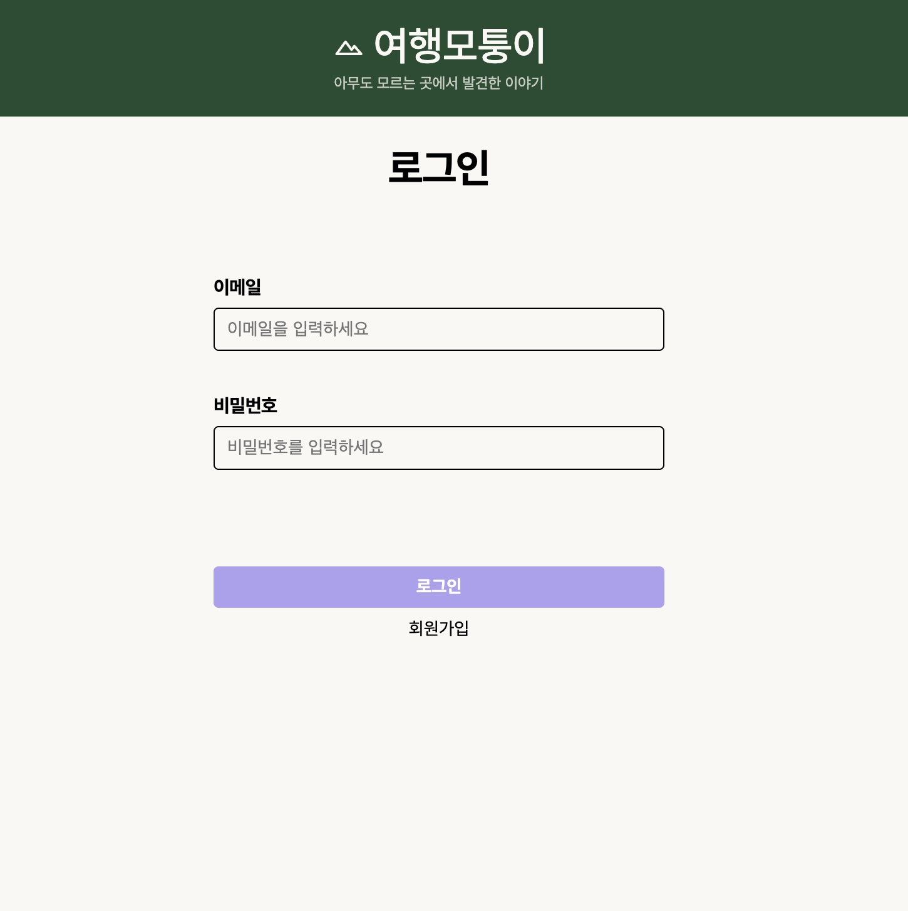
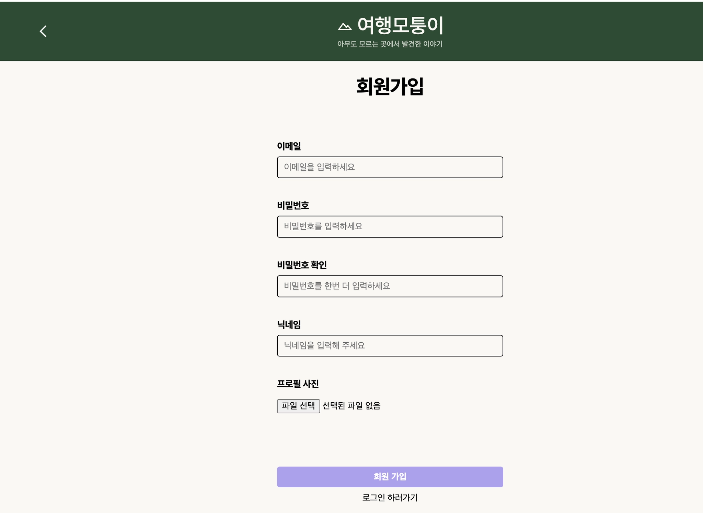
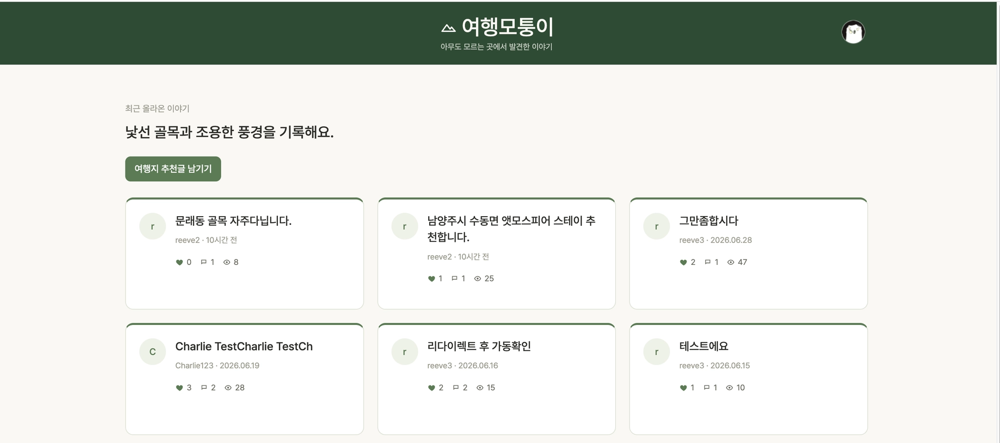
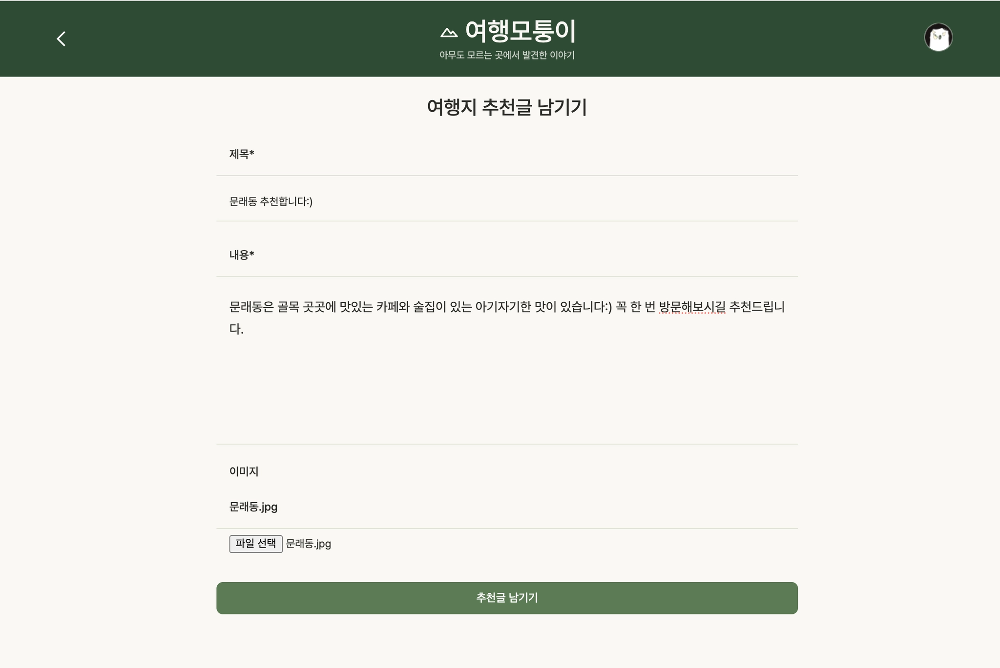
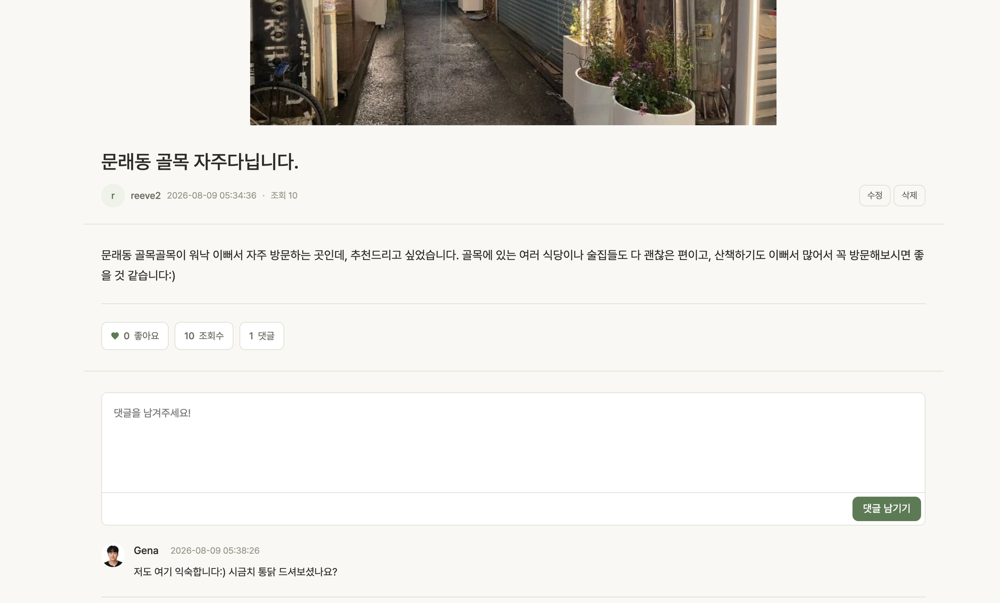
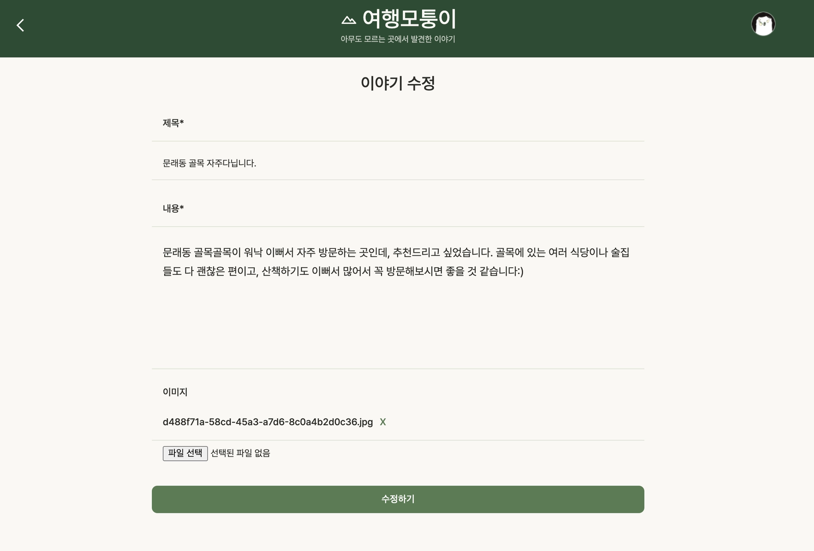
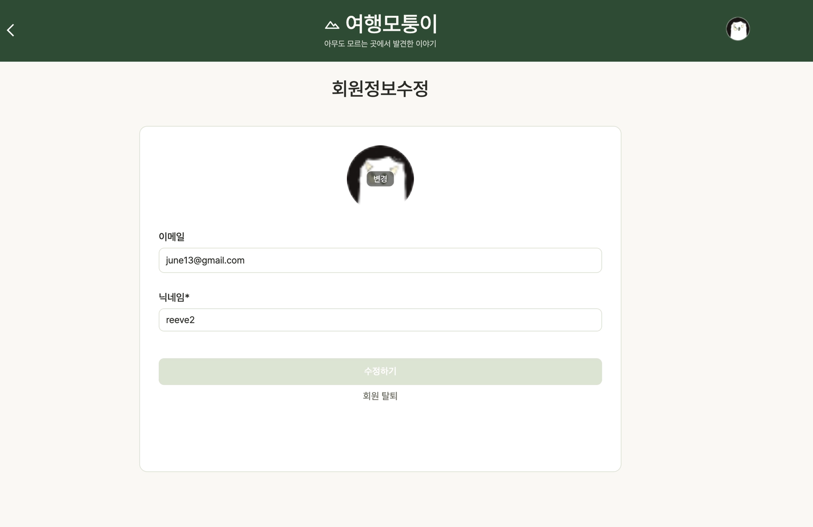
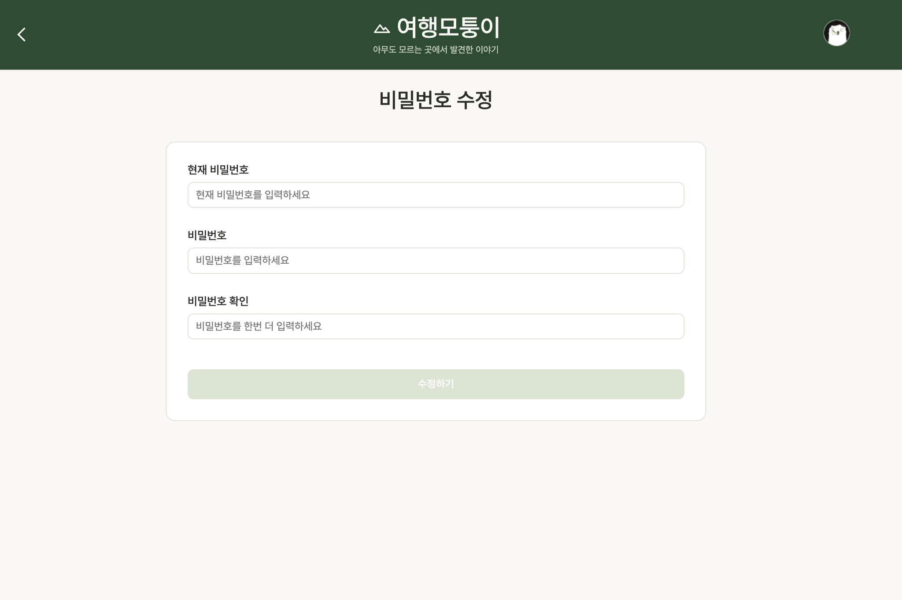
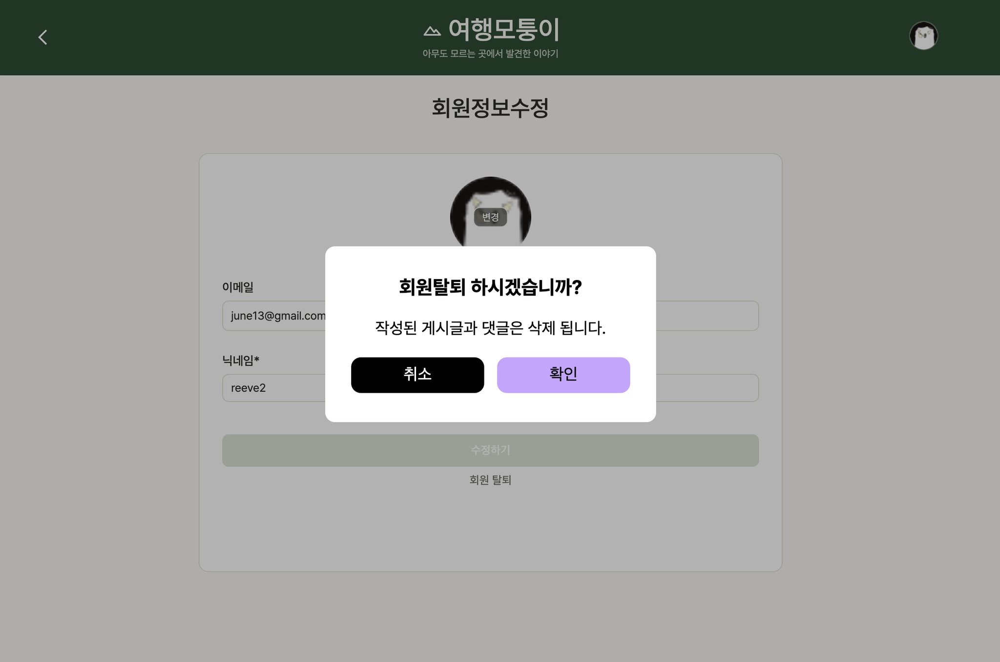

# 여행모퉁이

> 국내 숨은 여행지를 발굴하고 공유하는 커뮤니티 서비스입니다.


🔗 배포 링크: [여행모퉁이](https://k8s.reeve.o-r.kr/html/index.html)  
🔗 Backend Repository: [youn9jin/Community](https://github.com/youn9jin/Community)

---

## 프로젝트 소개

여행모퉁이는 개인의 여행 경험과 숨은 장소를 이야기로 남기고, 다른 사용자와 댓글과 좋아요로 소통할 수 있는 커뮤니티 프로젝트입니다.

## 개발 기간 및 인원

- 개발 기간: 2026. 05. 12 ~ 2026. 08. 09
- 개발 인원: reeve.joo(주영진)

## 사용 기술 및 Tools

- Vanilla JavaScript
- HTML5 / CSS3
- Node.js / Express.js
- dotenv
- Lottie Web CDN
- Docker
- GitHub Actions
- AWS ECR
- GitOps 배포 구성

## 주요 기능

- 회원가입 / 로그인 / 로그아웃
- Access Token 재발급 기반 인증 요청 처리
- 게시글 목록 조회 및 더 보기
- 게시글 작성 / 상세 조회 / 수정 / 삭제
- 게시글 이미지 업로드
- 댓글 작성 / 수정 / 삭제
- 게시글 좋아요 / 좋아요 취소
- 회원정보 수정
- 프로필 이미지 업로드 / 삭제
- 비밀번호 수정
- 회원 탈퇴

## 폴더 구조

<details>
<summary>폴더 구조 보기/숨기기</summary>

```text
4-reeve-community-FE
├── apiRequest
│   ├── board-writeRequest.js
│   ├── boardRequest.js
│   ├── commentRequest.js
│   ├── indexRequest.js
│   ├── loginRequest.js
│   ├── modifyInfoRequest.js
│   ├── modifyPasswordRequest.js
│   └── signupRequest.js
├── component
│   ├── avatar
│   ├── board
│   ├── comment
│   ├── dialog
│   └── header
├── css
│   ├── common
│   ├── board-write.css
│   ├── board.css
│   ├── index.css
│   └── login.css
├── deploy
│   ├── docker-compose.yml
│   └── fe-user-data.sh
├── html
│   ├── board-modify.html
│   ├── board-write.html
│   ├── board.html
│   ├── index.html
│   ├── login.html
│   ├── modifyInfo.html
│   ├── modifyPassword.html
│   └── signup.html
├── js
│   ├── board-write.js
│   ├── board.js
│   ├── index.js
│   ├── login.js
│   ├── modifyInfo.js
│   ├── modifyPassword.js
│   └── signup.js
├── public
├── utils
├── app.js
├── Dockerfile
├── package-lock.json
└── package.json
```

</details>

## 서비스 화면

### 인증

| 로그인 | 회원가입 |
| --- | --- |
|  |  |

### 게시글

| 게시글 목록 | 게시글 작성 | 게시글 상세 | 게시글 수정 |
| --- | --- | --- | --- |
|  |  |  |  |

### 회원

| 회원정보 수정 | 비밀번호 수정 | 회원 탈퇴 |
| --- | --- | --- |
|  |  |  |


## 배포

- Docker 이미지로 FE 서버를 패키징합니다.
- GitHub Actions에서 이미지를 빌드하고 AWS ECR에 push합니다.
- GitOps 저장소의 이미지 태그를 갱신하는 배포 흐름을 사용합니다.
